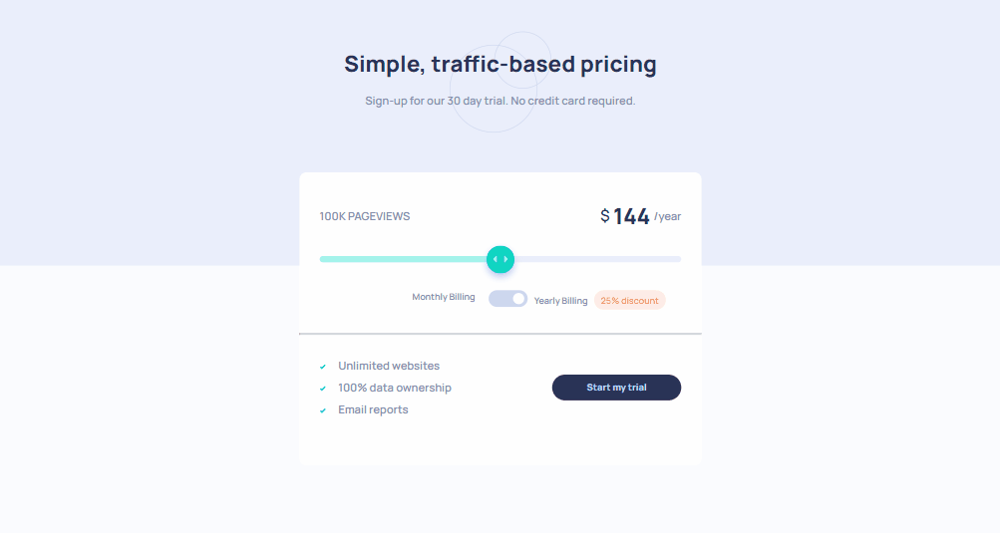
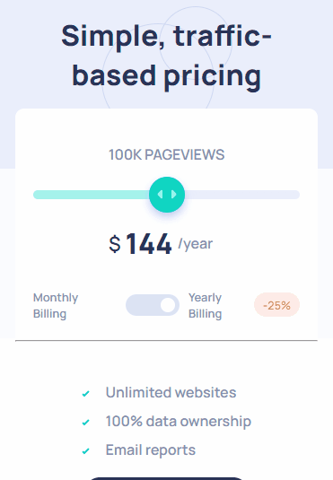

# Desafio Pricing Toggle - Frontend-Mentor

Este é um desafio de Pricing Toggle, proposto pelo site Frontend Mentor.

## Tabela de Conteúdos

- [Visão Geral](#visão-geral)
    - [Imagens](#imagens)
    - [Link da página](#link)
- [Processo](#processo)
    - [Linguagens utilizadas](#linguagens-utilizadas)
    - [O que aprendi](#o-que-aprendi)
    - [Possíveis evoluções](#possíveis-evoluções)
- [Autor](#autor)

## Visão-geral

### Imagens

<br>

````
Versão de Desktop
````

   

<br>

````
Versão Mobile
````

 

### Link

- Página no GitHub Pages: <a href="https://julio-mansan2.github.io/pricing-toggle">Clique aqui!</a>

## Processo

### Linguagens utilizadas

<br>

- Marcações semânticas de HTML5
- Propriedades de customização do CSS3
- Estruturas de JavaScript

<br>

### O que aprendi

<br>

- Utilizar o input "range":

````html

<input type="range" id="range" min="1" max="5" value="3">

````

- Aplicar uma função ao input "range":

````html

<section class="price">
    <span class="pageviews">1 0 0 k &nbsp p a g e v i e w s</span>
    <div class="bill-time">
        <span class="dollar">$</span>
        <h2 class="bill">16,00</h2>
        <span class="time">/month</span>
    </div>
</section>
<input type="range" id="range" min="1" max="5" value="3">
<section class="toggle">
    <p class="">Monthly Billing</p>
    <input type="checkbox" id="switch" /><label for="switch">Toggle</label>
    <div>
        <p class="">Yearly Billing</p>
        <span class="discount-desktop">25% discount</span>
        <span class="discount-mobile">-25%</span>
    </div>
</section>

````
````javascript

const time = document.querySelector(".time");
const bill = document.querySelector(".bill");
const range = document.getElementById("range");
const viewNumber = document.querySelector(".pageviews");
const switchInput = document.getElementById("switch");

range.addEventListener("input", () => {
    rangePoint();
  });
  
  switchInput.onclick = function () {
    if (switchInput.checked == true) {
      let price = bill.textContent;
      bill.textContent = (price - price * 0.25) * 12;
      time.textContent = "/year";
      rangePoint();
    } else {
      time.textContent = "/month";
      rangePoint();
    }
  };
  
  function rangePoint() {
    if (range.value == 1) {
      if (switchInput.checked == true) {
        bill.textContent = (8 - 8 * 0.25) * 12;
      } else {
        bill.textContent = 8;
      }
      viewNumber.textContent = "10k PAGEVIEWS";
      range.style.background = ` linear-gradient(
        to right,
        hsl(174, 77%, 80%) 0%,
        hsl(224, 65%, 95%) 0%,
        hsl(224, 65%, 95%) 100%
      )`;
    }
    if (range.value == 2) {
      if (switchInput.checked == true) {
        bill.textContent = 108;
      } else {
        bill.textContent = 12;
      }
      viewNumber.textContent = "50k PAGEVIEWS";
      range.style.background = ` linear-gradient(
        to right,
        hsl(174, 77%, 80%) 0%,
        hsl(174, 77%, 80%) 25%,
        hsl(224, 65%, 95%) 0%,
        hsl(224, 65%, 95%) 100%
      )`;
    }
    if (range.value == 3) {
      if (switchInput.checked == true) {
        bill.textContent = 144;
      } else {
        bill.textContent = 16;
      }
      viewNumber.textContent = "100k PAGEVIEWS";
      range.style.background = ` linear-gradient(
        to right,
        hsl(174, 77%, 80%) 0%,
        hsl(174, 77%, 80%) 50%,
        hsl(224, 65%, 95%) 0%,
        hsl(224, 65%, 95%) 100%
      )`;
    }
    if (range.value == 4) {
      if (switchInput.checked == true) {
        bill.textContent = 216;
      } else {
        bill.textContent = 24;
      }
      viewNumber.textContent = "500k PAGEVIEWS";
      range.style.background = ` linear-gradient(
        to right,
        hsl(174, 77%, 80%) 0%,
        hsl(174, 77%, 80%) 75%,
        hsl(224, 65%, 95%) 0%,
        hsl(224, 65%, 95%) 100%
      )`;
    }
    if (range.value == 5) {
      if (switchInput.checked == true) {
        bill.textContent = 324;
      } else {
        bill.textContent = 36;
      }
      viewNumber.textContent = "1M PAGEVIEWS";
      range.style.background = ` linear-gradient(
        to right,
        hsl(174, 77%, 80%) 100%,
        hsl(224, 65%, 95%) 0%,
        hsl(224, 65%, 95%) 100%
      )`;
    }
  }

````
<br>

### Possíveis evoluções

<br>

- Códigos mais compactos;
- Entender melhor acerca da estilização com position "absolute";

<br>

## Autor

GitHub - <a href="https://github.com/julio-mansan2">julio-mansan2</a> <br>
Front-end Mentor - <a href="https://www.frontendmentor.io/profile/julio-mansan2">julio-mansan2</a> <br>